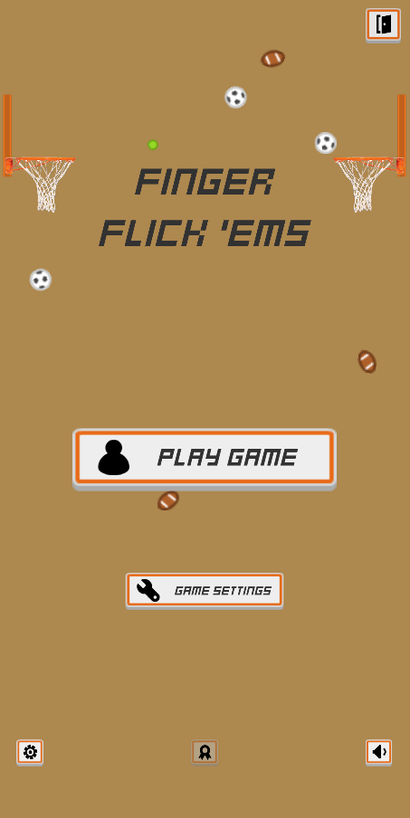
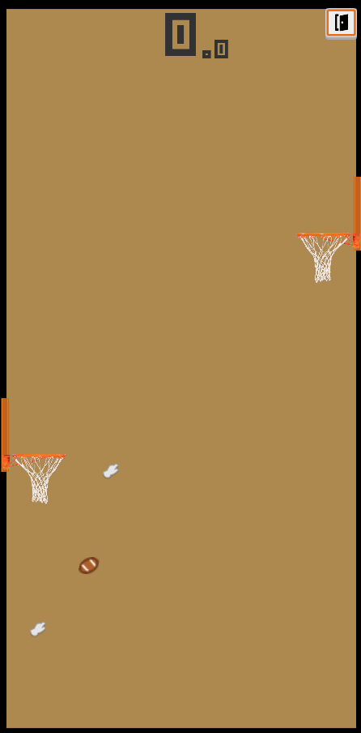
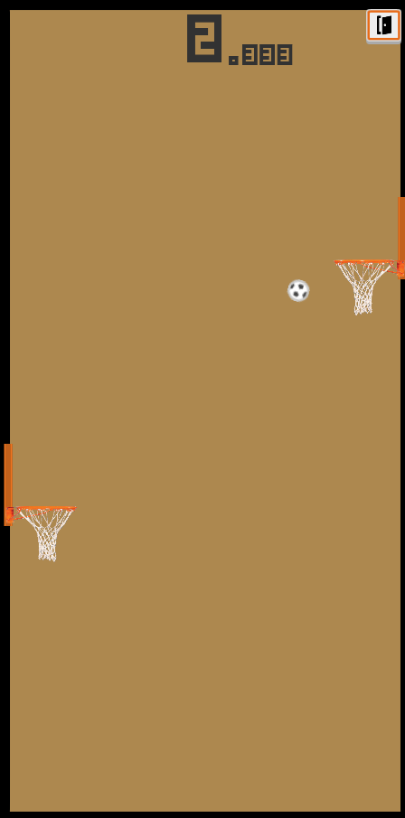
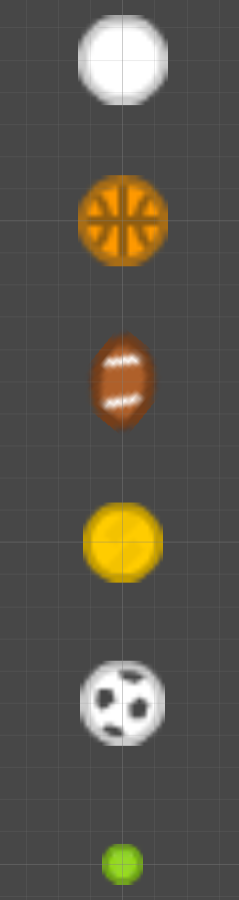
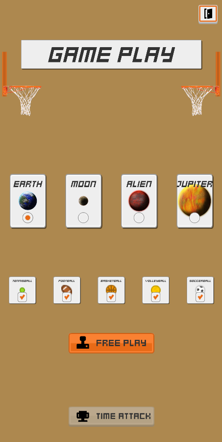

# Finger-Flick-Em
Flick the ball as fast as you can!

# Controls:
Click & Drag to launch the ball!

# Media:

# Stats:

| Name: | Tennisball | Football | Basketball | Volleyball | Soccerball | None |
|:--|:-:|:-:|:-:|:-:|:-:|:-:|
| Size (PPSI): | 94 | 60 | 64 | 72 | 68 | 64 |
| Bounciness: |  95% | 75% | 85% | 90% | 60% | 99.99% |
| Score: | 0.1 | 0.5 | 2.0 | 1.0 | 0.7 | 1.25 |
| Size: | 0.08 | N/A | 0.140625 | 0.125 | 0.1323529 | 0.140625 |

## Gravity Data:

1. Earth => 1.0
2. Moon => 0.2
3. Alien => Random.Range(0.2, 2.4)
4. Jupiter => 2.4

##### Licenses:
Are located throughout the project, each media folder contains a license text file.
